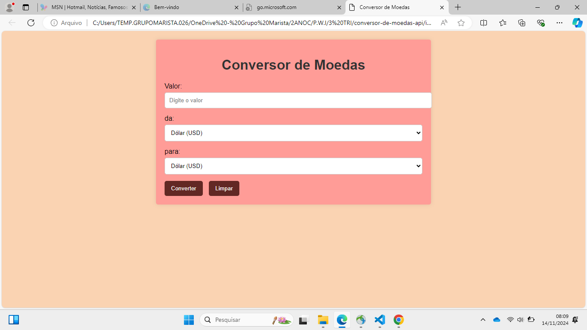

# Conversor de Moedas API - Projeto 2A
 
Este projeto é um **Conversor de Moedas API - tempo real** básico que permite ao usuário converter valores entre três moedas: Dólar Americano (USD), Real Brasileiro (BRL) e Euro (EUR).

 
## Funcionalidades
 
Conversões em Tempo Real: A API fornece taxas de câmbio atualizadas, o que permite que você realize conversões precisas entre diversas moedas.

Suporte a Múltiplas Moedas: A API oferece suporte a dezenas de moedas globais, permitindo que você converta entre várias combinações de moedas.

Facilidade de Uso: A chamada à API é simples e rápida, retornando dados no formato JSON, o que facilita a manipulação dos dados no JavaScript.

Atualização Constante: As taxas de câmbio são atualizadas regularmente, com intervalos que podem variar dependendo do plano escolhido (desde atualizações diárias até em tempo real, dependendo da API e do plano).
 
 
### Frontend
A interface foi desenvolvida usando **HTML** para o formulário de entrada e exibição do resultado.
 
- O formulário coleta o valor a ser convertido e as moedas de origem e destino.
 
### Backend (JavaScript)
O código JavaScript realiza a conversão com base em taxas de câmbio fixas definidas no próprio script
 
1. Quando o usuário submete o formulário, o código:
   - Previne o comportamento padrão (recarregar a página).
   - Obtém os valores informados pelo usuário.
   
2. O código então verifica se a moeda de origem é igual à moeda de destino:
   - Se for, o valor permanece o mesmo.
   - Se não for, o valor é multiplicado pela taxa de câmbio correspondente.
 
3. O resultado da conversão é exibido diretamente na página.
 
### Exemplo de Taxas de Câmbio
As taxas de câmbio usadas são as seguintes:
 
- 1 USD = 5.70 BRL
- 1 USD = 0.93 EUR
- 1 BRL = 0.18 USD
- 1 BRL = 0.16 EUR
- 1 EUR = 1.08 USD
- 1 EUR = 6.16 BRL
 
> **Nota:** As taxas de câmbio são fixas para fins de demonstração e podem não refletir os valores reais do mercado.
 
## Como usar?
 
1. Abra o arquivo HTML em qualquer navegador.
2. Insira o valor que deseja converter.
3. Selecione a moeda de origem e a moeda para a qual deseja converter.
4. Clique em "Converter" e veja o resultado na própria página.
 
 
 
## Referências
 
- [Documentação MDN sobre Manipulação de Formulários](https://developer.mozilla.org/pt-BR/docs/Learn/Forms)
- [Documentação sobre `addEventListener`](https://developer.mozilla.org/pt-BR/docs/Web/API/EventTarget/addEventListener)
- [Manipulação de DOM no JavaScript](https://developer.mozilla.org/pt-BR/docs/Web/API/Document_Object_Model)
 - Exemplos de Uso da Fetch API
---
 # 💋AUTORES
 [ Ana Beatriz Silva.](https://github.com/biasantorii) |

 